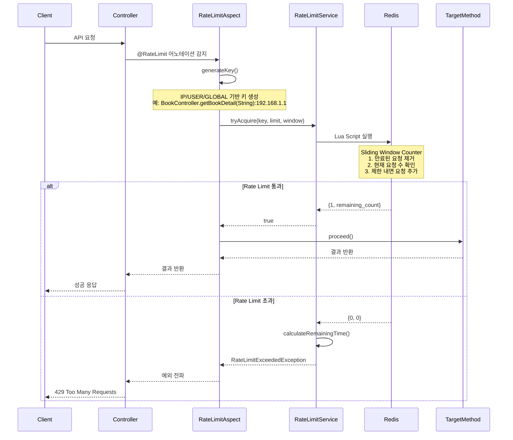

# Rate Limiting 구현

## 개요

이 시스템은 **Sliding Window Counter** 알고리즘을 사용하여 API 호출 빈도를 제한하는 Rate Limiting 기능을 제공합니다. Redis를 백엔드 스토리지로 사용하여 분산 환경에서도 일관된
Rate Limiting을 보장합니다.

## 시스템 아키텍처

### 주요 컴포넌트

1. **@RateLimit 어노테이션**: 메서드 레벨에서 Rate Limiting 설정
2. **RateLimitAspect**: AOP를 통한 Rate Limiting 로직 적용
3. **RateLimitService**: Redis 기반 Rate Limiting 핵심 로직
4. **RateLimitExceededException**: Rate Limit 초과 시 발생하는 예외

### 시퀀스 다이어그램



## 알고리즘: Sliding Window Counter

### 동작 원리

1. **Redis Sorted Set 사용**: 각 요청을 timestamp를 score로 하여 저장
2. **만료된 요청 제거**: 현재 시간에서 윈도우 크기를 뺀 시간보다 이전 요청들 제거
3. **현재 요청 수 확인**: 윈도우 내 요청 수가 제한 이하인지 확인
4. **원자적 실행**: Lua 스크립트로 모든 연산을 원자적으로 처리

### Lua 스크립트 로직

```lua
local key = KEYS[1]
local window = tonumber(ARGV[1])
local limit = tonumber(ARGV[2])
local current_time = tonumber(ARGV[3])

-- 현재 윈도우의 시작 시간
local window_start = current_time - window

-- 만료된 요청들 제거
redis.call('ZREMRANGEBYSCORE', key, 0, window_start)

-- 현재 윈도우 내의 요청 수 조회
local current_requests = redis.call('ZCARD', key)

if current_requests < limit then
    -- 제한 내라면 현재 요청 추가
    redis.call('ZADD', key, current_time, current_time)
    redis.call('EXPIRE', key, window)
    return {1, limit - current_requests - 1}
else
    -- 제한 초과
    return {0, 0}
end
```

## 사용법

### 기본 사용법

```java

@RestController
public class BookController {

    @GetMapping("/{isbn}")
    @RateLimit(limit = 200, window = 1) // 1분당 200회
    public ResponseEntity<Book> getBookDetail(@PathVariable String isbn) {
        // 구현...
    }
}
```

### 고급 설정

```java
// 사용자별 제한 (인증 구현 시)
@RateLimit(limit = 1000, keyType = KeyType.USER)

// 전역 제한
@RateLimit(limit = 10000, keyType = KeyType.GLOBAL)

// 커스텀 키 (SpEL 표현식)
@RateLimit(limit = 100, key = "#isbn + ':' + #ip")

// 시간 단위 변경
@RateLimit(limit = 10, window = 1, timeUnit = TimeUnit.HOURS)
```

## 키 생성 전략

### 기본 키 형식

```
rate_limit:<method_signature>:<identifier>
```

### 키 타입별 예시

1. **IP 기반** (기본값)
   ```
   rate_limit:BookController.getBookDetail(String):192.168.1.1
   ```

2. **사용자 기반**
   ```
   rate_limit:BookController.getBookDetail(String):user123
   ```

3. **전역 기반**
   ```
   rate_limit:BookController.getBookDetail(String):global
   ```

4. **커스텀 키**
   ```
   rate_limit:BookController.getBookDetail(String):9780134685991:192.168.1.1
   ```

## 에러 처리

### Rate Limit 초과 시 응답

```json
{
  "success": false,
  "code": 429,
  "message": "Rate limit exceeded. Limit: 100 requests per 60 seconds. Try again in 45 seconds.",
  "data": [],
  "timestamp": "2025-08-16T00:15:30"
}
```

### HTTP 헤더

Rate Limit 정보는 HTTP 응답 헤더로도 제공됩니다:

```
X-RateLimit-Limit: 100
X-RateLimit-Remaining: 95
X-RateLimit-Reset: 1692151200
```

## 장점과 특징

### 장점

1. **정확성**: Sliding Window로 더 정확한 Rate Limiting
2. **분산 환경 지원**: Redis를 통한 일관된 상태 관리
3. **원자적 연산**: Lua 스크립트로 race condition 방지
4. **유연성**: 다양한 키 전략과 SpEL 표현식 지원
5. **장애 복구**: Redis 장애 시 fail-open 정책

### 특징

1. **메모리 효율성**: 만료된 요청 자동 정리
2. **실시간 모니터링**: 현재 사용량 조회 가능
3. **IP 추출**: 프록시 환경 고려한 실제 클라이언트 IP 추출
